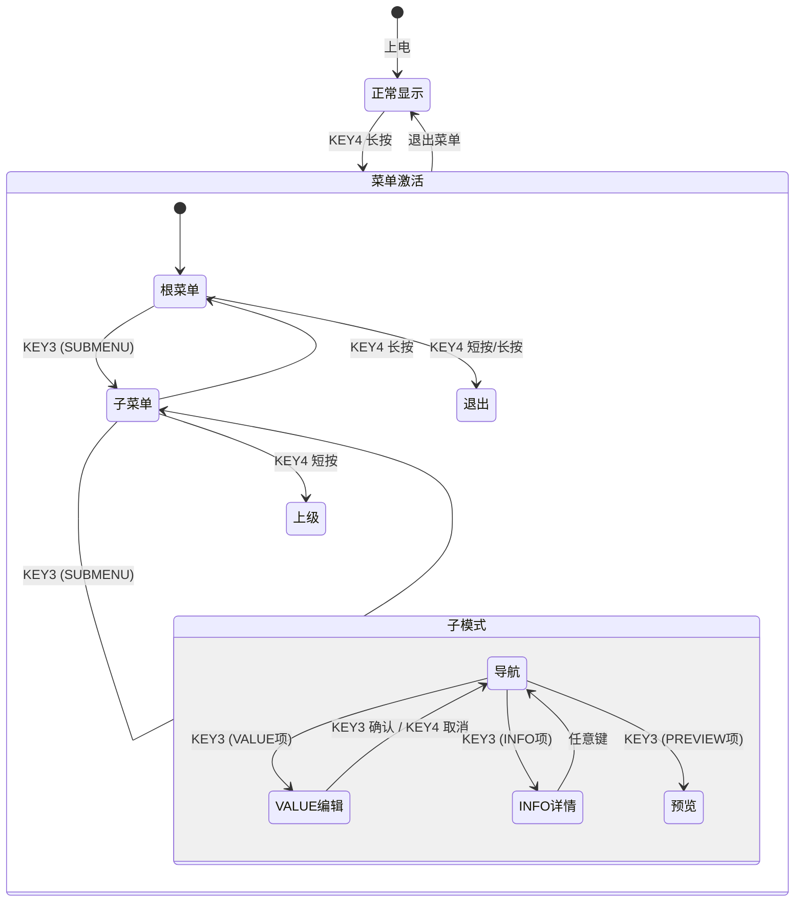

# 学习笔记 05 — 按键及菜单功能开发

> 以 `oled_prj` 项目的按键驱动（`key_drv`）与多级菜单系统（`menu_mgr` + `menu_items`）为实例，
> 系统学习嵌入式按键处理（消抖、长按、连发）与菜单状态机设计。
> 配套参考：[docs/menu-design.md](../../docs/menu-design.md)、[docs/menu-key-design.md](../../docs/menu-key-design.md)

---

## 一、按键驱动设计（key_drv）

### 1.1 硬件基础

| 按键 | GPIO | 模式 | 按下电平 |
|------|------|------|----------|
| KEY1 | PE1 | 上拉输入 | 低电平 (0) |
| KEY2 | PE2 | 上拉输入 | 低电平 (0) |
| KEY3 | PE3 | 上拉输入 | 低电平 (0) |
| KEY4 | PE4 | 上拉输入 | 低电平 (0) |

**核心难点**：机械按键按下/释放瞬间会产生**抖动**（几 ms 到几十 ms 的电平抖动），直接读 GPIO 会得到一堆毛刺。软件必须**消抖**。

### 1.2 消抖机制（状态机 + 连续确认）

```
raw 采样（每 20ms 一次）
    │
    ├─ 与上次 raw 相同? ──否──→ debounce_cnt = 0（复位）
    │         │
    │        是
    │    debounce_cnt++
    │         │
    │    cnt >= 3?  ──否──→ 继续等待
    │         │
    │        是（连续 3 次相同 = 60ms 确认）
    │         │
    │    raw != stable_state?
    │         │
    │    ┌────┴────┐
    │  是         否 → 无变化
    │    │
    │ 更新 stable_state
    │    │
    │ raw==0 (按下)      raw==1 (释放)
    │    │                  │
    │ 记录 press_start_tick  ├─ 之前长按? → RELEASE 事件
    │ long_press_fired=0     └─ 之前短按? → SHORT_PRESS 事件
    └────┘
```

**关键参数**：

| 参数 | 值 | 说明 |
|------|-----|------|
| `KEY_DEBOUNCE_MS` | 20ms | 采样间隔 |
| `DEBOUNCE_SAMPLES` | 3 | 连续确认次数 |
| 消抖总时长 | 60ms | 3 × 20ms |
| `KEY_LONG_PRESS_MS` | 2000ms | 长按判定阈值 |
| `KEY_LONG_REPEAT_MS` | 150ms | 长按后连发间隔 |

> **设计精髓**：不是"按 1 次就确认"，而是"**连续 3 次采样相同**才确认"——把抖动过滤和边沿检测合二为一。

### 1.3 事件类型

```c
typedef enum {
    KEY_EVENT_NONE              = 0,  // 无事件
    KEY_EVENT_SHORT_PRESS       = 1,  // 短按（按下→释放 < 2s）
    KEY_EVENT_LONG_PRESS        = 2,  // 长按（持续 ≥ 2s，仅触发一次）
    KEY_EVENT_RELEASE           = 3,  // 长按后的释放
    KEY_EVENT_LONG_PRESS_REPEAT = 4   // 长按连发（每 150ms 一次）
} key_event_t;
```

**事件驱动设计**：上层不关心"当前引脚电平"，只接收"事件"（短按/长按/连发）。这让菜单系统与硬件解耦。

### 1.4 长按检测：用真实时间，不用轮次计数

```c
// 每轮扫描用 HAL_GetTick() 计算真实时间差
if (stable_state == 0 && !long_press_fired)
{
    if (now - press_start_tick >= KEY_LONG_PRESS_MS)
    {
        long_press_fired = 1;
        // 产生 KEY_EVENT_LONG_PRESS
    }
}

// 长按已触发后，周期性产生 REPEAT（快速滚动）
if (stable_state == 0 && long_press_fired)
{
    if (now - last_repeat_tick >= KEY_LONG_REPEAT_MS)
    {
        last_repeat_tick = now;
        // 产生 KEY_EVENT_LONG_PRESS_REPEAT
    }
}
```

> **为什么不用扫描轮次计数？** 主循环可能因为其他任务变慢（如 OLED 刷屏、OTA 传输），用轮次计长按会不准。`HAL_GetTick()` 是单调的真实时间，不受主循环负载影响。

### 1.5 事件返回机制（防丢失）

```c
int key_drv_scan(key_info_t *info)
{
    /* ① 优先返回缓存的待处理事件 */
    for (int i = 0; i < KEY_COUNT; i++)
    {
        if (keys[i].event_pending)
        {
            info->key_id = i + 1;
            info->event  = keys[i].pending_event;
            keys[i].event_pending = 0;
            return 1;
        }
    }
    /* ② 无缓存才扫描 GPIO */
    ...
}
```

**设计要点**：一次扫描只返回**一个**事件，有事件缓存则优先返回。确保上层每次调用都能取到事件，不会因为主循环频率不稳定而丢事件。

---

## 二、菜单数据模型（menu_items）

### 2.1 菜单项类型

```c
typedef enum {
    MENU_TYPE_SUBMENU,  // 进入子菜单
    MENU_TYPE_TOGGLE,   // ON/OFF 开关
    MENU_TYPE_VALUE,    // 数值调节
    MENU_TYPE_ACTION,   // 执行回调
    MENU_TYPE_INFO,     // 纯信息显示
    // (实现中还扩展了 PREVIEW / CONFIRM)
} menu_item_type_t;
```

### 2.2 菜单项结构体（重点：联合体节省内存）

```c
typedef struct menu_item {
    const char *text;            // 显示文本 (UTF-8)
    menu_item_type_t type;
    union {
        // SUBMENU: 子菜单指针 + 项数
        struct { const struct menu_item **items; uint8_t count; } submenu;

        // TOGGLE: 指向共享状态变量，checked_value 决定何时显示 [x]
        struct { uint8_t *value_ptr; uint8_t checked_value;
                 void (*on_change)(uint8_t); } toggle;

        // VALUE: 数值范围 + 步长 + 回调
        struct { uint8_t *value_ptr; uint8_t min, max, step;
                 void (*on_change)(uint8_t); } value;

        // ACTION: 回调函数指针
        void (*action)(void);

        // INFO: 详情文本
        struct { const char *detail_text; } info;
    };
} menu_item_t;
```

**为什么用 union？** 每个菜单项同一时刻只需要一种类型的数据。若用独立字段，每个菜单项都占用所有类型的内存；用 union 只占最大的那个，**静态菜单表可以全部存 Flash（.rodata），RAM 占用极小**。

### 2.3 菜单树结构（本项目实际）

```
root (虚拟 SUBMENU)
├── 1.工作模式 → [本地] [远程]                        ← TOGGLE (共享 g_remote_mode)
├── 2.显示内容 → 时间/天气/日期/自定义文字              ← ACTION ×4
├── 3.显示特效 → 静态/左滚/右滚/上滚/下滚/翻页/淡入淡出   ← ACTION ×7
├── 4.设置 → 对比度设置 → 对比度 [000~255]             ← SUBMENU → VALUE
├── 5.LED控制 → 关闭/常亮/闪烁                        ← ACTION ×3
├── 6.上电文字 → 欢迎语/Logo/大号文字                  ← PREVIEW
├── 7.系统信息 → 固件版本/运行时间                     ← SUBMENU → INFO
└── 8.预留 → 三级示例 → 选项A/B/C                     ← SUBMENU → ACTION
```

**最大深度**：`MENU_MAX_DEPTH = 8`

### 2.4 状态变量 + 回调桥接（关键设计）

**菜单不直接操作硬件**，通过回调桥接到系统模块：

| 菜单项 | 操作变量 | 回调 | 桥接目标 |
|--------|----------|------|----------|
| 工作模式 (TOGGLE) | `g_remote_mode` | `cb_mode_changed()` | `display_mgr_set_remote()` |
| 对比度 (VALUE) | `g_contrast` | `cb_contrast_changed()` | `ssd1306_set_contrast()` |
| 显示内容 (ACTION) | — | `cb_disp_time()` 等 | `display_mgr_set_sub_mode()` |
| 显示特效 (ACTION) | — | `cb_effect_static()` 等 | `display_mgr_set_mode()` |
| LED控制 (ACTION) | — | `cb_led_off()` 等 | `led_mgr_set_state()` |

**状态同步**：菜单激活时调用 `menu_items_init_state()`，把系统当前状态同步回菜单变量（如当前是否远程模式），保证菜单显示与系统实际一致。

---

## 三、菜单引擎状态机（menu_mgr）

### 3.1 核心状态结构

```c
typedef struct {
    const menu_item_t **current_menu;   // 当前层菜单项数组
    uint8_t            current_menu_count;
    uint8_t            cursor;          // 光标位置
    uint8_t            scroll_offset;   // 滚动偏移
    menu_context_t     stack[MENU_MAX_DEPTH];  // 导航栈（每层保存 cursor+scroll）
    uint8_t            depth;           // 当前深度
    bool               active;          // 菜单是否激活
    bool               dirty;           // 需要重绘标记
    bool               value_editing;   // VALUE 编辑模式
    uint8_t            value_backup;    // 编辑前备份（KEY4 取消恢复）
    bool               info_showing;    // INFO 详情页
    const char        *info_detail;
    bool               preview_showing; // 预览模式
    bool               confirm_showing; // 确认对话框
    void             (*confirm_callback)(void);
} menu_state_t;
```

### 3.2 主状态图



### 3.3 按键映射

**正常导航模式**：

| 按键 | 短按 | 长按 | 长按连发 |
|------|------|------|----------|
| KEY1 | 光标下移 | — | 连续下移 |
| KEY2 | 光标上移 | — | 连续上移 |
| KEY3 | 确认（进入子菜单/切换TOGGLE/进入VALUE编辑/执行ACTION/显示INFO） | — | — |
| KEY4 | 返回上级（根层退出菜单） | 回到根菜单 | — |

**VALUE 编辑模式**：

| 按键 | 短按 | 长按/连发 |
|------|------|-----------|
| KEY1 | 减小 1 步长 | 快速减小（5×步长） |
| KEY2 | 增大 1 步长 | 快速增大（5×步长） |
| KEY3 | 确认当前值，退出编辑 | — |
| KEY4 | 取消，恢复备份值，退出编辑 | — |

**非菜单模式（正常显示）**：

| 按键 | 事件 | 功能 |
|------|------|------|
| KEY1 | 短按 | 切换显示特效 |
| KEY2 | 短按 | 切换 LED 状态 |
| KEY4 | 长按 | 激活菜单 |

### 3.4 导航栈与返回机制（重点）

**为什么需要导航栈？** 用户进入子菜单后返回，要恢复"这一层之前的光标位置"——如果每次进入都从第 0 项开始，体验很差。

```c
进入子菜单 (enter_submenu):
  1. stack[depth] ← {cursor, scroll_offset}   // 保存当前层状态
  2. depth++
  3. current_menu ← submenu.items
  4. cursor = 0, scroll_offset = 0

返回上级 (exit_submenu):
  1. depth--
  2. 恢复 stack[depth] 中的 cursor 和 scroll_offset
```

> **数据结构学习点**：用**显式栈**保存每层上下文，而不是递归——裸机上递归有栈溢出风险，且无法持久化中间状态。

---

## 四、OLED 菜单渲染

### 4.1 屏幕布局（128×64，4 行 × 16px）

```
┌──────────────────────────────┐  y=0  (page 0~1)
│ ▶ 工作模式                   │
├──────────────────────────────┤  y=16 (page 2~3)
│   显示内容                    │
├──────────────────────────────┤  y=32 (page 4~5)
│   显示特效                    │
├──────────────────────────────┤  y=48 (page 6~7)
│   OLED对比度                 │
└──────────────────────────────┘
```

- 中文字体 16×16，ASCII 字体 8×16，每行 2 pages
- 选中行反白显示（整行白底黑字）

### 4.2 TOGGLE 项（开关）

```
│ ▶ 本地                 [x]   │  ← 选中，右侧显示当前状态
│   远程                 [ ]   │  ← 互斥：选远程时本地自动取消
```

### 4.3 VALUE 项（数值）

```
│ ▶ 对比度调节          [128]  │  ← KEY3 进入编辑，KEY1=增，KEY2=减
```

文本超宽截断并追加省略号，不与右侧数值重叠。

### 4.4 滚动指示器（超过 4 项时）

```
│   菜单项2                    │
│ ▶ 菜单项3                    │  ← 光标在此
│   菜单项4                    │
│   …… (共7项)                 │  ← 第 4 行显示提示，仅当下方还有项
```

### 4.5 渲染策略

- 只画一帧到 ssd1306 的 buffer，**仅在按键触发时重绘**（dirty 标记）
- 退出菜单时调用 `display_mgr_redraw()` 恢复显示
- 菜单激活期间抑制远程帧刷屏，避免冲突

---

## 五、按键 → 菜单的完整事件流

```
主循环 user_app_handle()
  │
  ├─ key_drv_scan() → 返回 key_info_t (key_id + event)
  │
  ├─ 菜单激活中?
  │   ├─ 是 → menu_mgr_handle_key(key_id, event)
  │   └─ 否 → 非菜单按键处理（KEY1 特效/KEY2 LED/KEY4 激活菜单）
  │
  ├─ menu_mgr_tick()  ← 每帧渲染（dirty 时重绘）
  │
  └─ 按键事件通过 UART 上报上位机（除 LONG_PRESS_REPEAT）
```

**理解**：key_drv 负责"采集物理按键 → 生成事件"，menu_mgr 负责"消费事件 → 导航 + 渲染"，user_app 负责"分发"。三者职责清晰、单向依赖。

---

## 六、踩坑与经验总结

1. **消抖必须"连续确认"而非"延时跳过"**：`debounce_cnt >= 3` 的方式天然抗抖动，且不阻塞主循环
2. **长按计时用 HAL_GetTick() 真实时间**：轮次计数在主循环负载变化时会失真
3. **事件驱动优于电平查询**：上层只认事件，与硬件解耦，测试也方便（可模拟事件）
4. **菜单数据用 union 压缩内存**：静态 const 存 Flash，RAM 只占最大成员
5. **导航栈显式保存每层光标**：递归实现有栈溢出风险
6. **菜单不直接碰硬件**：全部通过回调桥接，菜单系统可独立测试
7. **一次扫描只返回一个事件 + 待处理缓存**：防止主循环频率不稳导致丢事件
8. **KEY1/KEY2 方向约定要文档同步**：实现中 KEY1=下、KEY2=上（与早期设计相反），改方向必须同步改文档

---

## 七、自测题

1. 按键消抖的原理是什么？本项目用几个采样点确认，总时长多少？
2. 长按检测为什么用 HAL_GetTick() 而不是扫描轮次计数？
3. `menu_item_t` 里为什么用 union？带来什么好处？
4. 菜单返回上级时如何恢复光标位置？
5. 为什么菜单不直接操作硬件而是通过回调桥接？
6. `KEY_EVENT_LONG_PRESS_REPEAT` 事件的作用是什么？
7. 菜单激活期间为什么抑制远程帧刷屏？

<details>
<summary>参考答案</summary>

1. 连续多次采样相同才确认电平变化，过滤抖动；3 次 × 20ms = 60ms
2. HAL_GetTick() 是单调真实时间，不受主循环负载影响，轮次计数会失真
3. 不同菜单类型共享同一块内存，只占最大成员大小，静态表可存 Flash，RAM 占用极小
4. 用导航栈保存每层 {cursor, scroll_offset}，返回时 pop 恢复
5. 解耦硬件：菜单系统可独立测试，硬件替换（如换屏）不影响菜单逻辑
6. 长按后每 150ms 产生一次，实现快速滚动/快速调值
7. 避免远程帧刷新与菜单渲染冲突（撕裂/闪烁），退出菜单时再恢复显示

</details>
