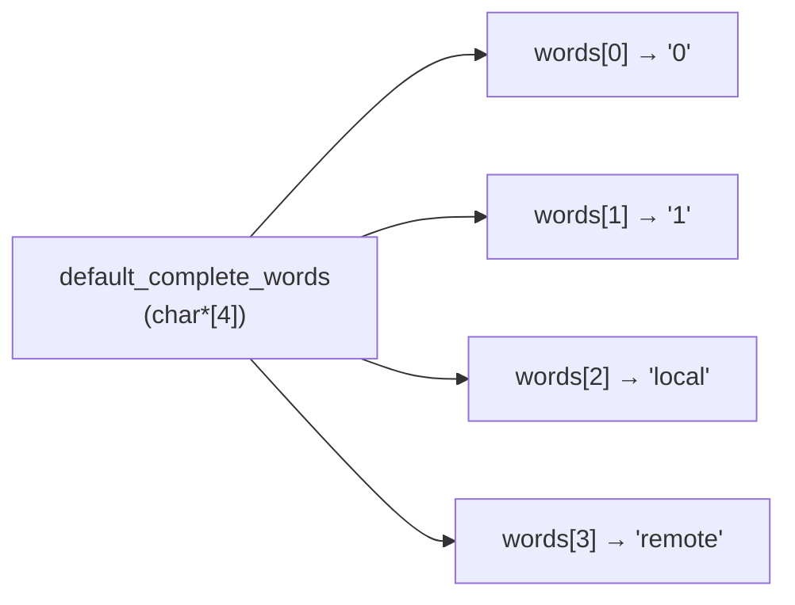

# 知识笔记：数组形参退化 与 二级指针

> 来源：`stm32f407/src/cli_cmds.c` 中 `cli_cmds_coplete_words_register(char *words[], uint16_t size)` 的签名讨论。

---

## 一、核心结论

**`char *words[]` 作为函数形参时，与 `char **words` 完全等价**，但语义上表示"一组字符串"，比 `char **` 更清晰。

不能改成 `char *words`，因为那表示"一个字符串"，无法表达"多个字符串"。

---

## 二、三种写法的辨析

| 写法 | 类型 | 含义 | 能否用于批量注册 |
|------|------|------|------------------|
| `char *words` | `char *` | 单个字符串 | ❌ |
| `char *words[]` | 退化为 `char **` | 字符串数组（指针数组） | ✅ |
| `char **words` | `char **` | 指向 `char *` 的指针 | ✅ |

### 为什么 `char *words[]` 等价于 `char **words`？

C 语言规定：**数组作为函数形参时，一律退化为指向首元素的指针**。这是编译器的固定行为，无论你写成 `[]` 还是 `*`。

```c
// 以下两个声明完全相同
void f(char *words[], int n);   // 编译器看到的是 char **words
void f(char **words,  int n);   // 一模一样
```

因此 `char *words[]` 里的 `[]` 只是给"人"看的提示：这是一个指针数组。

---

## 三、内存模型（关键）

```c
char *default_complete_words[] = { "0", "1", "local", "remote" };
```

内存中实际有两层：



- `default_complete_words` 本身是一个**数组**，每个元素是一个 `char *`（指针）。
- 数组名在表达式/传参中退化为 `char **`，指向第一个指针元素。
- 这就是"二级指针"：**指向指针的指针**。

访问 `words[i]` 的实际动作：

```c
words[i]        // 等价于 *(words + i)   → 得到第 i 个 char*
strcmp(words[i], ...)   // 用这个 char* 去比较字符串内容
```

---

## 四、二级指针的概念

### 定义

> 二级指针是指向指针的指针，类型为 `T **`，其值是"某个 `T *` 变量在内存中的地址"。

```c
int    a   = 10;
int   *p   = &a;      // 一级指针：存 a 的地址
int  **pp  = &p;      // 二级指针：存 p 的地址

printf("%d\n",  a);    // 10
printf("%d\n", *p);    // 10
printf("%d\n", **pp);  // 10  ← 两次解引用
```

### 解引用层级

| 表达式 | 类型 | 值 |
|--------|------|-----|
| `pp` | `int **` | 指针 `p` 的地址 |
| `*pp` | `int *` | 即 `p`，`a` 的地址 |
| `**pp` | `int` | 即 `a`，值为 10 |

---

## 五、二级指针的四大典型用法

### 1. 函数内修改"指针本身"（最常见、最重要）

C 是值传递，若想修改外部一级指针的指向，必须传二级指针。

```c
void allocate(int **out)
{
    *out = malloc(sizeof(int));
    **out = 42;
}

int main(void)
{
    int *p = NULL;
    allocate(&p);        // 传 &p，即 int**
    printf("%d\n", *p);  // 42
    free(p);
    return 0;
}
```

> 若写成 `allocate(int *out)`，`out = malloc(...)` 只改了形参副本，外部 `p` 仍是 `NULL`，造成经典 bug。

### 2. 字符串数组（指针数组）传参 — 即本案例

```c
void print_all(char *words[], int n)
{
    for (int i = 0; i < n; i++)
    {
        printf("%s\n", words[i]);
    }
}

char *names[] = { "alpha", "beta", "gamma" };
print_all(names, 3);
```

### 3. 动态二维数组

```c
int rows = 3, cols = 4;
int **matrix = malloc(rows * sizeof(int *));
for (int i = 0; i < rows; i++)
{
    matrix[i] = malloc(cols * sizeof(int));
}
matrix[1][2] = 99;   // 等同于 *(*(matrix+1)+2)
```

### 4. 链表头指针的修改

```c
void push_front(node_t **head, int val)
{
    node_t *n = malloc(sizeof(node_t));
    n->val = val;
    n->next = *head;
    *head = n;          // 修改外部 head 指针本身
}

push_front(&list, 5);   // 传 node_t**
```

---

## 六、本案例更严谨的写法建议

当前实现里，`words` 传入的都是字符串字面量（只读数据），用 `char *words[]` 接收可能触发"丢弃 const"警告。更严谨：

```c
// 函数签名
int cli_cmds_coplete_words_register(const char *words[], uint16_t size);

// 需同步修改全局数组声明，否则赋值处类型不匹配
const char *auto_complete_words[CLI_COMPLETE_ITEMS_MAX];
```

`const char *words[]` 的含义拆解：**一个数组，元素是指向常量字符的指针**（可以改指针指向，不能改指针指向的内容）。

---

## 七、记忆口诀

1. **数组形参 = 指针**：`T arr[]` 和 `T *p` 做形参永远等价。
2. **要看清楚"谁"退化成指针**：`char *words[]` 是"指针数组"（数组元素是指针），不是"数组的指针"。
3. **想改外部指针 → 传二级指针**：`int *` 用 `int **`，`char *` 用 `char **`。
4. **字符串数组 = `char *[]` = `char **`**，字面量加 `const` 更严谨。

---

## 八、易混淆对照表

| 类型 | 中文名 | 说明 |
|------|--------|------|
| `char *p` | 字符指针 | 指向一个字符串 |
| `char *arr[]` | 指针数组 | 数组元素是 `char *`，退化为 `char **` |
| `char (*p)[]` | 数组指针 | 指向整个数组（极少用，别与上者混淆） |
| `char **pp` | 二级指针 | 指向 `char *` |

关键区别记忆：**`[]` 优先级高于 `*`**，所以 `char *arr[]` 先结合成"数组"，再是"数组的元素为指针"。
