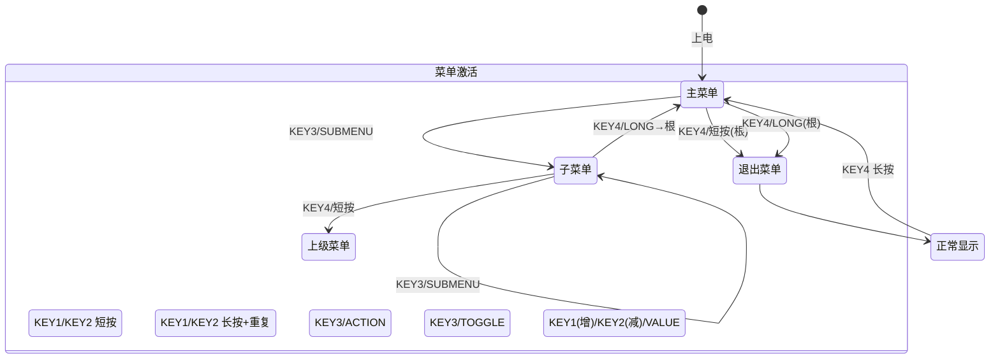

# OLED 多级菜单系统 — 方案设计文档

> 版本: v1.0  
> 日期: 2026-08-04  
> 目标: STM32F407 + SSD1306 128×64 OLED + 4 按键  
> 遵循: 现有分层架构

---

## 一、技术选型

### 1.1 LVGL 可行性评估

| 维度 | LVGL v8/v9 | 自制轻量菜单 |
|------|-----------|-------------|
| Flash 占用 | ~60-80KB (最小裁剪) | ~3-5KB |
| RAM 占用 | ~32KB (1/6 双缓冲 + widget 树) | ~1-2KB |
| 适配工作量 | 需编写 SSD1306 单色显示驱动 + 输入设备驱动 + LVGL 配置 | 直接复用现有 `ssd1306`/`font`/`key_drv` |
| 128×64 单色屏体验 | LVGL widget 体系为彩色高分屏设计，单色小屏大量功能无用 | 精确针对 4 行 × 16px 设计 |
| 代码可控性 | 黑盒程度高、调试困难、出问题难以定位 | 完全自主，逻辑透明 |
| 构建复杂度 | 需集成 LVGL 源码到 Makefile/Keil | 3 个新增文件 (含 .h/.c) |

**结论: 不推荐 LVGL。** 采用自制 `menu_mgr` 模块，轻量、可控、与现有架构无缝集成。

---

## 二、菜单树结构

```
主菜单
├── 1. 工作模式
│   ├── 1.1 本地                 [x]
│   └── 1.2 远程                 [ ]
├── 2. 显示内容
│   ├── 2.1 时间               → 切换到远程模式+TIME子模式
│   ├── 2.2 天气               → 切换到远程模式+WEATHER子模式
│   ├── 2.3 日期               → 切换到远程模式+DATE子模式
│   └── 2.4 自定义文字         → 本地/远程均可
├── 3. 显示特效 (本地模式有效)
│   ├── 3.1 静态
│   ├── 3.2 左滚
│   ├── 3.3 右滚
│   ├── 3.4 上滚
│   ├── 3.5 下滚
│   ├── 3.6 翻页
│   └── 3.7 淡入淡出
├── 4. OLED 对比度
│   └── 对比度调节             [数值 0~255]
├── 5. LED 控制
│   ├── 5.1 关闭
│   ├── 5.2 常亮
│   └── 5.3 闪烁
├── 6. 上电文字
│   └── [进入文字选择/编辑] (预留)
├── 7. 系统信息
│   ├── 固件版本
│   └── 运行时间
└── 8. 预留
    └── 8.1 三级菜单示例
        ├── 8.1.1 选项A        → 确认后 DEBUG_PRINTF("menu: 三级示例-选项A")
        ├── 8.1.2 选项B        → 确认后 DEBUG_PRINTF("menu: 三级示例-选项B")
        └── 8.1.3 选项C        → 确认后 DEBUG_PRINTF("menu: 三级示例-选项C")
```

---

## 三、按键映射与导航规则

### 3.1 按键映射

| 按键 | 物理引脚 | 短按 | 长按 (≥2s) |
|------|---------|------|-----------|
| KEY1 | PE1 | **上** — 光标上移 / 值增加 | 快速连续上翻 (每 150ms 重复) |
| KEY2 | PE2 | **下** — 光标下移 / 值减少 | 快速连续下翻 (每 150ms 重复) |
| KEY3 | PE3 | **确认** — 进入子菜单 / 执行动作 / 切换开关 | (无) |
| KEY4 | PE4 | **返回** — 返回上级 / 主菜单中退出菜单; 正常显示时无操作 | 非根菜单回主菜单根节点; 主菜单中退出菜单 |

### 3.2 菜单激活/退出

```
上电 → 自动进入主菜单
主菜单中 KEY4 短按 → 退出菜单, 恢复正常显示
子菜单中 KEY4 短按 → 返回上级, 恢复该层光标
正常显示中 KEY4 长按 → 激活菜单, 回到主菜单
正常显示中 KEY4 短按 → 无操作
```

> 注意: 这会占用 KEY4 长按原有的"切换本地/远程模式"功能, 该功能移到菜单"工作模式"子菜单中操作。

### 3.3 长按快速滚动规则

- KEY1/KEY2 首次按下 → 光标移动 1 格 (消抖后瞬时响应)
- 持续按住 ≥2s → 触发 `KEY_EVENT_LONG_PRESS`，开始快速滚动
- 之后每 150ms 产生 `KEY_EVENT_LONG_PRESS_REPEAT` 事件，光标自动移动
- 按键释放 → 停止重复

---

## 四、导航状态机



---

## 五、128×64 OLED 显示布局

### 5.1 普通菜单项

```
┌──────────────────────────────┐  y=0  ─ page 0~1
│ ▶ 工作模式                   │
├──────────────────────────────┤  y=16 ─ page 2~3
│   显示内容                    │
├──────────────────────────────┤  y=32 ─ page 4~5
│   显示特效                    │
├──────────────────────────────┤  y=48 ─ page 6~7
│   OLED对比度                 │
└──────────────────────────────┘
```

规格: 128×64 全屏, 每行 16px (2 pages), 共 4 行。
字体: 中英文混排, 16×16 中文字体, 8×16 ASCII 字体。

### 5.2 TOGGLE 项 (开关)

```
┌──────────────────────────────┐
│ ▶ 本地                 [x]   │  ← 选中, 右侧显示当前模式
│   远程                 [ ]   │  ← 互斥: 选远程时本地自动取消
└──────────────────────────────┘
```

### 5.3 VALUE 项 (数值)

选中时按 KEY3 进入编辑; 编辑中 KEY1 增加、KEY2 减少、KEY3 确认、KEY4 取消。文本超宽时截断并追加省略号, 不与右侧数值重叠。

```
┌──────────────────────────────┐
│ ▶ 对比度调节          [128]  │  ← KEY3 进入编辑, 编辑中 KEY1=增, KEY2=减, KEY3/KEY4 退出
└──────────────────────────────┘
```

### 5.4 滚动指示器 (超过 4 项时)

当子菜单超过 4 项且下方还有未显示项时, 最后一行显示提示; 滚到底时最后一项完整显示:

```
┌──────────────────────────────┐
│   菜单项2                    │
│ ▶ 菜单项3                    │  ← 光标在此
│   菜单项4                    │
│   …… (共7项)                 │  ← 第4行 = "…… (共N项)", 仅当下方还有项
└──────────────────────────────┘
```

### 5.5 反白选中效果

选中行: 整行白色背景 + 黑色文字 (反转 page 内所有 bit)。
非选中行: 黑色背景 + 白色文字 (正常渲染)。

---

## 六、模块设计

### 6.1 分层归属

遵循现有分层架构, `menu_mgr` 属于**应用模块层**:

```
┌─────────────────────────────────────────┐
│          user_app (应用入口)              │  ← 编排: 按键分发
├─────────────────────────────────────────┤
│  display_mgr │ led_mgr │ menu_mgr (新增) │  ← 应用模块层
│  sys_config  │ debug_console            │
├─────────────────────────────────────────┤
│  protocol │ font                        │  ← 协议/中间件层
├─────────────────────────────────────────┤
│  ssd1306 │ key_drv │ uart_drv │ i2c_drv │  ← 硬件驱动层
│  iwdg_drv │ sys_tick                    │
├─────────────────────────────────────────┤
│  STM32 HAL                              │
└─────────────────────────────────────────┘
```

### 6.2 新增文件

| 文件 | 层级 | 职责 |
|------|------|------|
| `inc/menu_mgr.h` | 应用模块层 | 菜单管理器公开接口 |
| `src/menu_mgr.c` | 应用模块层 | 菜单导航状态机 + 渲染逻辑; 退出时调用 `display_mgr_redraw()` |
| `src/menu_items.c` | 应用模块层 | 菜单树静态数据定义, 全部为 `const`, 存于 Flash |

### 6.3 修改文件

| 文件 | 修改内容 |
|------|---------|
| `inc/key_drv.h` | 新增 `KEY_EVENT_LONG_PRESS_REPEAT` 事件类型; 新增 `KEY_LONG_REPEAT_MS` 宏 |
| `src/key_drv.c` | 长按触发后每 `KEY_LONG_REPEAT_MS` 产生 REPEAT 事件; 释放时发送 `KEY_EVENT_RELEASE` |
| `inc/display_mgr.h` | 新增 `display_mgr_redraw()` 声明; 新增远程帧刷屏抑制开关 |
| `src/display_mgr.c` | 新增 `display_mgr_redraw()` 恢复显示; 菜单激活期间只拼装远程帧, 不直接刷屏 |
| `src/user_app.c` | 按键处理分支: 菜单激活时交给 `menu_mgr`; KEY4 长按改为激活菜单; 主循环增加 `menu_mgr_tick()` |

### 6.4 menu_mgr.h 接口设计

```c
#ifndef __MENU_MGR_H
#define __MENU_MGR_H

#include <stdint.h>
#include <stdbool.h>
#include "key_drv.h"

/* 初始化菜单系统 (构建菜单树, 进入主菜单) */
void menu_mgr_init(void);

/* 处理按键事件 (由 user_app 按键分发调用) */
void menu_mgr_handle_key(uint8_t key_id, key_event_t event);

/* 每帧渲染 (由 user_app 主循环调用, ~50ms 周期) */
void menu_mgr_tick(void);

/* 查询/切换菜单激活状态 */
bool menu_mgr_is_active(void);
void menu_mgr_activate(void);
void menu_mgr_deactivate(void);

/* 检查菜单是否发生变化 (优化: 仅变化时刷新 OLED) */
bool menu_mgr_is_dirty(void);

#endif
```

### 6.5 核心数据结构

```c
/* 菜单项类型 */
typedef enum {
    MENU_TYPE_SUBMENU,      /* 进入子菜单 */
    MENU_TYPE_TOGGLE,       /* ON/OFF 开关, 按确认切换 */
    MENU_TYPE_VALUE,        /* 数值调节, KEY3 进入编辑, KEY1/KEY2 增减, KEY3 确认退出 */
    MENU_TYPE_ACTION,       /* 执行回调函数 */
    MENU_TYPE_INFO,         /* 纯信息显示 (如版本号), 按确认/返回退出 */
} menu_item_type_t;

/* 菜单项定义 (存储于 Flash, const) */
typedef struct menu_item {
    const char            *text;          /* 显示文本 (UTF-8) */
    menu_item_type_t       type;          /* 菜单项类型 */
    union {
        /* SUBMENU: 子菜单数组 (NULL 结尾) */
        struct {
            const struct menu_item **items;
            uint8_t                  count;
        } submenu;

        /* TOGGLE: 指向 bool (0/1) */
        struct {
            uint8_t *value_ptr;             /* 指向实际状态变量的指针 */
            void   (*on_change)(uint8_t);   /* 状态变化回调 (可选) */
        } toggle;

        /* VALUE: 数值范围调节 */
        struct {
            uint8_t *value_ptr;             /* 指向实际值变量的指针 */
            uint8_t  min, max;              /* 调节范围 */
            uint8_t  step;                  /* 每次调节步长 */
            void   (*on_change)(uint8_t);   /* 值变化回调 (可选) */
        } value;

        /* ACTION: 执行回调 */
        void (*action)(void);

        /* INFO: 纯信息显示 */
        struct {
            const char *detail_text;        /* 详细信息文本 */
        } info;
    };
} menu_item_t;

/* 每层菜单保存的光标状态 */
typedef struct {
    uint8_t            cursor;          /* 该层上次选中索引 (0-based) */
    uint8_t            scroll_offset;   /* 该层上次滚动偏移 (用于 >4 项菜单) */
} menu_context_t;

/* 菜单管理器内部状态 */
typedef struct {
    const menu_item_t *current_menu;    /* 当前菜单 (指向 items 数组) */
    uint8_t            current_menu_count; /* 当前菜单项数 */
    uint8_t            cursor;          /* 当前选中索引 (0-based) */
    uint8_t            scroll_offset;   /* 滚动偏移 (用于 >4 项菜单) */
    menu_context_t     stack[MENU_MAX_DEPTH]; /* 父级菜单上下文栈 */
    uint8_t            depth;           /* 当前层级深度 (0=主菜单) */
    bool               active;          /* 菜单是否激活 */
    bool               dirty;           /* 是否需要重绘 */
    bool               value_editing;   /* 是否处于数值编辑模式 */
} menu_state_t;
```

进入子菜单时先把当前层的 `cursor`/`scroll_offset` 压入 `stack[depth]`, 再进入子菜单并从第 0 项开始; 返回时弹出该层状态并恢复光标与滚动偏移。`MENU_MAX_DEPTH` 取 8, 覆盖菜单树最大深度。

---

## 七、key_drv 改动详情

### 7.1 key_drv.h 新增

```c
/* 新增事件类型 */
typedef enum {
    KEY_EVENT_NONE              = 0,
    KEY_EVENT_SHORT_PRESS       = 1,
    KEY_EVENT_LONG_PRESS        = 2,
    KEY_EVENT_RELEASE           = 3,   /* 释放 (保留, 与上位机解析一致) */
    KEY_EVENT_LONG_PRESS_REPEAT = 4,   /* 长按保持中, 周期性重复, 仅菜单内部使用 */
} key_event_t;

/* 长按重复间隔 */
#define KEY_LONG_REPEAT_MS  150
```

> 说明: `KEY_EVENT_RELEASE` (3) 保留, 与现有上位机按键动作解析对应; 新增 `KEY_EVENT_LONG_PRESS_REPEAT` (4) 仅供菜单快速滚动使用, 不通过 `CMD_KEY_EVENT` 上报。`docs/protocol-uart.md` 的动作编码需同步为 1=短按, 2=长按, 3=释放, 4=重复(仅菜单内部)。

### 7.2 key_drv.c 改动

```c
/* key_dev_t 结构体新增字段 */
uint32_t last_repeat_tick;     /* 上次重复触发时刻 */
uint8_t  release_pending;      /* 是否有释放事件待处理 */

/* 长按检测逻辑: 触发后改为周期性产生 REPEAT 而非一次性 LONG_PRESS */
if (keys[i].stable_state == 0 && !keys[i].long_press_fired) {
    if (now - keys[i].press_start_tick >= KEY_LONG_PRESS_MS) {
        keys[i].long_press_fired = 1;
        keys[i].last_repeat_tick = now;
        /* 首次触发: 产生 LONG_PRESS (用于回调通知长按开始) */
        keys[i].pending_event = KEY_EVENT_LONG_PRESS;
        keys[i].event_pending = 1;
    }
}

/* 长按已触发状态下, 周期性产生 REPEAT */
if (keys[i].stable_state == 0 && keys[i].long_press_fired) {
    if (now - keys[i].last_repeat_tick >= KEY_LONG_REPEAT_MS) {
        keys[i].last_repeat_tick = now;
        keys[i].pending_event = KEY_EVENT_LONG_PRESS_REPEAT;
        keys[i].event_pending = 1;
    }
}

/* 释放时清除长按状态, 不影响短按逻辑 (短按在释放时已处理) */
if (raw == 1 && keys[i].stable_state == 1 && keys[i].long_press_fired) {
    keys[i].long_press_fired = 0;
    keys[i].pending_event = KEY_EVENT_RELEASE;
    keys[i].event_pending = 1;
}
```

---

## 八、集成方式

### 8.1 user_app.c 改动

```c
// --- 现有按键处理逻辑 ---
if (key_drv_scan(&key_info)) {

    // 【新增】菜单激活时, 按键交给 menu_mgr
    if (menu_mgr_is_active()) {
        menu_mgr_handle_key(key_info.key_id, key_info.event);
    }
    else {
        // 【保留】原有按键逻辑, 但 KEY4 长按不再切换模式, 改为激活菜单
        switch (key_info.key_id) {
        case 1:
            display_mgr_next_mode();
            send_mode_status();
            break;
        case 2:
            // LED 切换 (保留)
            {
                uint8_t next = (led_mgr_get_state() + 1) % 3;
                led_mgr_set_state((led_state_t)next);
                send_led_status();
            }
            break;
        case 4:
            // 【修改】KEY4 长按激活菜单; 正常显示中短按无操作
            if (key_info.event == KEY_EVENT_LONG_PRESS) {
                menu_mgr_activate();  /* 正常显示中短按不激活 */
            }
            break;
        }
    }
    // 【保留】按键事件上报上位机; REPEAT 事件不上报
    if (key_info.event != KEY_EVENT_LONG_PRESS_REPEAT) {
        send_key_event(key_info.key_id, key_info.event);
    }
}

// --- 显示刷新 ---
{
    static uint32_t disp_tick = 0;
    uint32_t now = sys_tick_ms();
    if (now - disp_tick >= 50) {
        disp_tick = now;

        // 【新增】菜单 tick (含渲染)
        if (menu_mgr_is_active()) {
            menu_mgr_tick();
        } else {
            display_mgr_tick();
        }
    }
}

```

### 8.2 user_app_init 改动

```c
int user_app_init(void)
{
    // ... 现有初始化 ...

    display_mgr_init(sys_config_get_boot_text());

    // 【新增】初始化菜单, 上电进入主菜单
    menu_mgr_init();

    return 0;
}
```

### 8.3 退出菜单后的显示恢复

`menu_mgr_deactivate()` 内部调用新增的 `display_mgr_redraw()`, 规则如下:

- 本地模式: 重绘当前文字/特效 (`DISP_MODE_STATIC` 也必须重绘, 不能依赖 `display_mgr_tick()`)
- 远程模式: 菜单激活期间 `CMD_FRAME_SYNC` 仍正常拼装最近一帧, 但禁止直接刷屏; 退出后由 `display_mgr_redraw()` 一次性刷出最近完整帧
- 远程/本地切换仍以 `display_mgr_is_remote()` 为唯一真源, 菜单 TOGGLE 互斥更新该状态

---

## 九、渲染流程

### 9.1 渲染时机

```
menu_mgr_tick() 被 user_app 主循环每 ~50ms 调用一次
  ↓
检查 menu_state.dirty (是否需要重绘)
  ↓ 是
清除 ssd1306 buffer → 逐行绘制 → ssd1306_update_screen()
  ↓
重置 dirty 标志
```

### 9.2 逐行绘制逻辑

```
for (row = 0; row < 4; row++):
    item_index = scroll_offset + row
    if item_index >= total_items: break

    y = row * 16

    if item_index == cursor:  // 选中行
        计算 "▶ " + 文本 + (右侧状态/数值) 的像素宽度
        绘制文字 (反白: 先画白色矩形, 再画黑色文字)
    else:  // 普通行
        计算 "   " + 文本 + (右侧状态/数值)
        绘制文字 (正常: 画白色文字)

    if total_items - item_index > 1:  // 下方还有未显示项
        该行显示 "…… (共N项)" 提示 (即第4行让位给指示器)
    else:
        正常绘制该项
```

### 9.3 反白实现

```c
/* 在指定 page 行内绘制反白文字 */
static void draw_text_inverted(uint8_t page_start, const char *text)
{
    // 1. 先用显存填充该行所有像素为 1 (白色背景)
    for (uint8_t x = 0; x < SSD1306_WIDTH; x++) {
        buffer[page_start * SSD1306_WIDTH + x] = 0xFF;
        buffer[(page_start + 1) * SSD1306_WIDTH + x] = 0xFF;
    }
    // 2. 再以 SSD1306_COLOR_BLACK (擦除) 绘制文字
    draw_text(page_start, x, text, SSD1306_COLOR_BLACK);
}
```

---

## 十、回调函数约定

菜单项中的回调函数 (`action`, `on_change`) 需要桥接到现有系统接口:

| 菜单功能 | 回调实现 |
|---------|---------|
| 切换本地/远程模式 | `display_mgr_set_remote(bool)` + `send_mode_status()` |
| 切换显示内容 (时间/天气/日期/文字) | `display_mgr_set_sub_mode()` + 若本地→远程先 set_remote |
| 切换显示特效 | `display_mgr_set_mode(mode)` |
| 调节对比度 | `ssd1306_set_contrast(value)` |
| 切换 LED | `led_mgr_set_state(state)` + `send_led_status()` |
| 编辑上电文字 | `sys_config_set_boot_text()` + `sys_config_save()` (预留) |
| 三级菜单示例 (选项A/B/C) | `DEBUG_PRINTF("menu: 三级示例-选项X")` (仅打印) |

#### 三级菜单示例实现

选项A/B/C 均为 `MENU_TYPE_ACTION` 类型, 确认时仅打印调试信息, 不执行实际功能。
回调函数示例 (定义在 `menu_items.c` 中):

```c
static void action_demo_a(void) { DEBUG_PRINTF("menu: demo level3 - option A"); }
static void action_demo_b(void) { DEBUG_PRINTF("menu: demo level3 - option B"); }
static void action_demo_c(void) { DEBUG_PRINTF("menu: demo level3 - option C"); }
```

菜单项定义示例:

```c
static const menu_item_t item_demo_a = {
    .text = "选项A", .type = MENU_TYPE_ACTION, .action = action_demo_a,
};
static const menu_item_t item_demo_b = {
    .text = "选项B", .type = MENU_TYPE_ACTION, .action = action_demo_b,
};
static const menu_item_t item_demo_c = {
    .text = "选项C", .type = MENU_TYPE_ACTION, .action = action_demo_c,
};

static const menu_item_t *menu_demo_items[] = {
    &item_demo_a, &item_demo_b, &item_demo_c, NULL
};

static const menu_item_t item_demo = {
    .text = "三级示例", .type = MENU_TYPE_SUBMENU,
    .submenu = { .items = menu_demo_items, .count = 3 },
};
```

导航路径: `主菜单 → 预留 → 三级示例 → 选项A/B/C → 确认后打印 → 停留在当前页`

---

## 十一、内存与性能评估

| 指标 | 估算值 | 说明 |
|------|-------|------|
| Flash 占用 | ~2KB (代码) + ~1KB (菜单树数据) | 菜单树全为 `const` 编译期数据, 存于 .rodata |
| RAM 占用 | ~60B (`menu_state_t` + 菜单栈) + 复用 `ssd1306 buffer` (1024B) | 渲染使用全局 buffer, 不额外分配 |
| 每帧渲染时间 | ~24ms @168MHz | SSD1306 按 8 page 刷屏, 每 page 发送 3B 命令 + 128B 数据, 400kHz I²C 下约 21ms, 计入总线开销约 24ms |
| 渲染频率 | 仅按键事件触发重绘, 非连续刷新 | 静止时不消耗 CPU |

---

## 十二、构建依赖

Makefile 中新增 2 个编译单元 (`menu_mgr.c` / `menu_items.c`), 修改 `user_app.c` 不新增编译单元:

```makefile
# stm32f407/Makefile
PROJ_SRC += src/menu_mgr.c
PROJ_SRC += src/menu_items.c
```

无外部库依赖, 仅依赖现有:
- `ssd1306.h` — 显存buffer、画点、刷屏接口
- `font.h` — ASCII/中文点阵字模
- `key_drv.h` — 按键事件类型
- `display_mgr.h` — 模式切换接口
- `led_mgr.h` — LED 控制接口
- `sys_config.h` — 上电文字配置接口
- `stdint.h`, `stdbool.h`, `string.h` — 标准C库

---

## 十三、测试要点

| 测试场景 | 预期行为 |
|---------|---------|
| 上电 | 自动进入主菜单, 显示 8 项 |
| KEY1 单次 | 光标上移 1 格 |
| KEY2 单次 | 光标下移 1 格 |
| KEY1 长按 2s | 开始快速上翻, 每 150ms 移动 1 格 |
| KEY2 长按 2s | 开始快速下翻, 每 150ms 移动 1 格 |
| KEY3 (SUBMENU) | 进入子菜单从第 0 项开始; 返回时恢复父级光标 |
| KEY3 (TOGGLE) | 本地/远程互斥切换, 以 `display_mgr_is_remote()` 为唯一真源, 右侧状态即时刷新 |
| KEY3 (VALUE) | 进入数值编辑模式, KEY1/KEY2 增减, KEY3 确认, KEY4 取消 |
| KEY3 (ACTION) | 执行回调, 屏幕不变 |
| KEY4 短按 (子菜单) | 返回上一级, 光标恢复上次位置 |
| KEY4 短按 (主菜单) | 退出菜单, `display_mgr_redraw()` 恢复显示 |
| KEY4 长按 (非根菜单) | 返回主菜单根节点 |
| KEY4 长按 (主菜单) | 退出菜单, 恢复正常显示 |
| 退出后 KEY4 长按 | 重新激活菜单, 进入主菜单 |
| 子菜单 >4 项 | 滚动指示器正确显示 |
| 子菜单光标滚到末尾 | 最后一项完整显示, 不再出现 "…… (共N项)" |
| 三级菜单确认选项A/B/C | DEBUG_PRINTF 打印 "menu: 三级示例-选项X", 停留在当前页 |
| 中英文混排 | 正确以 16×16 / 8×16 混合绘制 |
